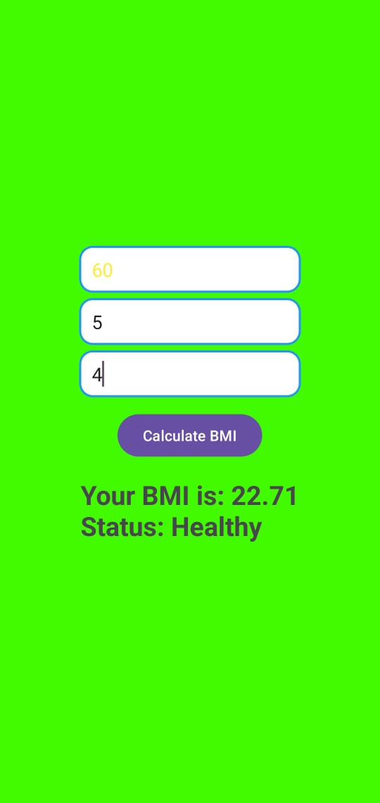

# 🧮 BMI Calculator App (Android)  
> A clean, modern & beginner-friendly **BMI Calculator App** made in **Android Studio (Java)** ✅  
Calculate BMI instantly and get health status like **Underweight, Healthy, Overweight, Obese** with dynamic UI colors 🎨

---

<p align="center">
  
  
  
</p>

---

## ✨ Features

✅ Simple UI with 3 Input Fields  
✅ Takes input in **Weight (kg)** + **Height (Feet & Inches)**  
✅ Calculates **BMI** accurately using formula  
✅ Shows BMI Category:  
- 🔵 Underweight  
- 🟢 Healthy  
- 🟠 Overweight  
- 🔴 Obese  

✅ Background changes automatically based on BMI result 🎨  
✅ Rounded border input fields + modern design  
✅ Beginner friendly code structure  

---

## 📱 Screenshots

> Add your screenshots inside a folder named **screenshots/**

📌 Example:

| Home Screen | Result Screen |
|------------|--------------|
|  |  |

✅ *Tip:* Take screenshots from Emulator / Mobile and upload in `screenshots/`

---

## 🧠 BMI Formula Used

📌 **BMI = Weight(kg) / (Height(m) × Height(m))**

Height conversion:

✅ `Feet + Inches → Total Inches`  
✅ `Inches → Meters (inch × 0.0254)`

---

## 🛠️ Tech Stack

- 📌 Android Studio  
- ☕ Java  
- 🎨 XML UI Design  
- ✅ Works on most Android versions  

---

## 📂 Project Structure

BMI Calculator App/
│── app/
│ ├── src/main/java/...
│ │ ├── MainActivity.java
│ ├── src/main/res/
│ │ ├── layout/activity_main.xml
│ │ ├── drawable/edittext_border.xml
│ │ ├── values/colors.xml
│── README.md

---

## 🚀 How to Run This Project

1️⃣ Download / Clone this repository  
```bash
git clone https://github.com/hariomsonihs/BMI-DEMO-APP.git
```bash
2️⃣ Open in Android Studio
3️⃣ Sync Gradle
4️⃣ Click ▶ Run

✅ App will run in Emulator or Mobile


---

If you want ✅ I can also make:
✅ **App logo icon** ideas  
✅ **Proper screenshot layout** for GitHub  
✅ A **best repository name + description + tags** for SEO on GitHub
---


## 👨‍💻 Developer Details

- **Name:** Hariom  
- **Role:** Android Developer | Java Programmer  
- **Project:** BMI Calculator App  
- **Email:** hariomsoni0818@gmail.com  
- **GitHub:** https://github.com/hariomsonihs  
- **LinkedIn:** https://www.linkedin.com/in/hariomsonihs/  
---
